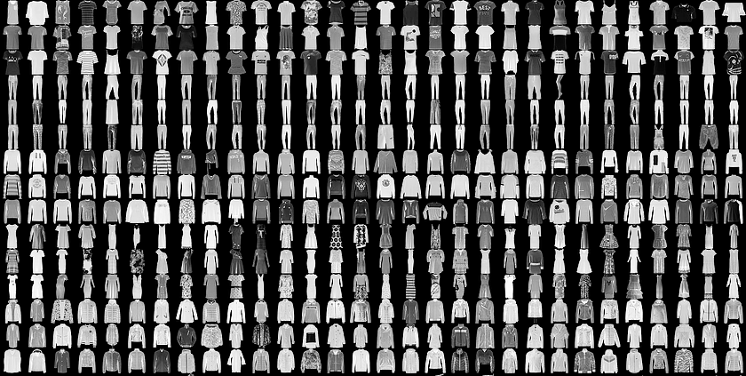

# Training an Image Classifier with DTI Tracker

In this guide, we train an image classifier on the Fashion-MNIST data set.



## Requirements

- If you haven’t already, [install and verify Tracker](./../../INSTALL.md)
before proceeding with this guide.
- Go to GitHub (or any other git) and set up an empty repository
[Optional, but recommended].

## Creating the Project

Create a YAML file called `fashion_mnist.yaml` located anywhere on your PC,
with the following content:

```yaml
template: 'https://github.com/dti-research/ml-template.git'
overwrite_if_exists: True
project:
    project_name: 'Fashion MNIST'
    repo: 'git@github.com:USER/REPO.git'
    author_name: 'AUTHOR'
    organization: 'Danish Technological Institute (DTI Research)'
    output_dir: '.'
    description: 'Testing Tracker on Fashion MNIST'
    open_source_license: 'BSD-3-Clause'
    linter: 'flake8'
    python_interpreter: 'python3'
```

Remember to change all the project specific keys to your needs. Tracker will
create your new project from where it is called if you do not change
`output_dir`.

> **_NOTE:_**  If you did not created an empty repository you must delete the `'repo'` keay from the project configuration file.

Invoke the tracker create command:

```bash
tracker create fashion_mnist.yaml
```

Tracker will now pull the latest template from the specified source and setup
your project including pushing it to the empty Git repo you created at the
beginning of this guide.

## Image Classifier Training Script

In the `src/` folder of your new project you have folders specific to data
processing, feature building, model training and visualisation, which is great
for larger projects. Here we create a single training script in `src/`
called `train.py` containing the following code (file [here](https://github.com/dti-research/tracker/blob/master/examples/fashion_mnist/train.py)):

```python
#!/usr/bin/python3
# Copyright (c) 2019, Danish Technological Institute (DTI Research)
# All rights reserved.
#
# This source code is licensed under the BSD-3-Clause-style license found in the
# LICENSE file in the root directory of this source tree.

import argparse

from tensorflow.keras.callbacks import TensorBoard
from tensorflow.keras.datasets import fashion_mnist
from tensorflow.keras.layers import Dense, Dropout
from tensorflow.keras.models import Sequential
from tensorflow.keras.optimizers import RMSprop
from tensorflow.keras.utils import to_categorical

parser = argparse.ArgumentParser(description='Simple feedforward test w/ TF on Fashion MNIST')
parser.add_argument('--seed', metavar='N', type=int,
                    help='Seed for the pseudo-random number generator',
                    required=True)
parser.add_argument('--epochs', metavar='N', type=int,
                    help='Number of epochs', required=True)
parser.add_argument('--batch_size', metavar='N', type=int,
                    help='Batch size', required=True)
parser.add_argument('--dropout', metavar='N', type=float,
                    help='Dropout', required=True)
parser.add_argument('--lr', metavar='N', type=float,
                    help='Learning rate', required=True)
parser.add_argument('--lr_decay', metavar='N', type=float,
                    help='Learning rate decay', required=True)
args = parser.parse_args()


# 1. Set `PYTHONHASHSEED` environment variable at a fixed value
import os
os.environ['PYTHONHASHSEED']=str(args.seed)
# 2. Set `python` built-in pseudo-random generator at a fixed value
import random
random.seed(args.seed)
# 3. Set `numpy` pseudo-random generator at a fixed value
import numpy as np
np.random.seed(args.seed)
# 4. Set `tensorflow` pseudo-random generator at a fixed value
import tensorflow as tf
tf.random.set_seed(args.seed)


(x_train, y_train), (x_test, y_test) = fashion_mnist.load_data()
x_train = x_train.reshape(60000, 784)
x_test = x_test.reshape(10000, 784)
x_train = x_train.astype('float32')
x_test = x_test.astype('float32')
x_train /= 255
x_test /= 255
y_train = to_categorical(y_train, 10)
y_test = to_categorical(y_test, 10)

model = Sequential()
model.add(Dense(512, activation='relu', input_shape=(784,)))
model.add(Dropout(rate=args.dropout, seed=args.seed))
model.add(Dense(512, activation='relu'))
model.add(Dropout(rate=args.dropout, seed=args.seed))
model.add(Dense(10, activation='softmax'))

model.compile(
    loss='categorical_crossentropy',
    optimizer=RMSprop(lr=args.lr, decay=args.lr_decay),
    metrics=['accuracy'])

model.fit(
    x_train, y_train,
    batch_size=args.batch_size,
    epochs=args.epochs,
    verbose=1,
    validation_data=(x_test, y_test),
    callbacks=[TensorBoard(".")])
```

## Creating Experiments

Now comes the time to conduct our first experiment using our small CNN on
the Fashion-MNIST data set. We start by creating an experiment configuration
file by invoking:

```bash
tracker experiment create cnn_test
```

*or*

```bash
tracker experiment run EXECUTABLE_FILE:OPERATION_NAME parameters.seed.value=42 parameters.batch_size.value=42 [...]
```

where `cnn_test` could be any unique identifier for your experiment. Remember
that you have to be at the root of the project when invoking this command. You
can always do a `tracker ls` to see the list of Tracker projects and
subsequently a `tracker cd PROJ_NAME` to cd into the project directory.

The command will create an empty configuration file and prompt you for
operation name (e.g. train, test, evaluate, etc.), script location, seed and
parameter values (using the values found in the script as default values).
Expiriment configuration files are by default placed in the `experiments`
folder within your project.

The resulting experiment configuration file will look similar to:

```yaml
- experiment: pytorch-mnist
  description: Using Tracker to do good science!
  operations:
    train:
      requires: train_data
      parameters:
        batch-size:
          value: 64
        test-batch-size:
          value: 1000
        epochs:
          value: 1
        lr:
          description: Learning rate
          value: 0.01
        momentum:
          value: 0.5
        seed:
          description: Preset number (or list of numbers) to set for pseudo-random number generators
          value: 42
        log-interval:
          value: 10
      environments:
        - name: pytorch
          type: docker
          image: pytorch/pytorch:1.3-cuda10.1-cudnn7-runtime
          executable: src/pytorch_train.py
    test:
      requires: test_data
      parameters:
        batch-size:
          value: 128
        seed:
          description: Preset number (or list of numbers) to set for pseudo-random number generators
          value: 42
      environments:
        - name: pytorch
          type: docker
          image: pytorch/pytorch:1.3-cuda10.1-cudnn7-runtime
          executable: src/pytorch_test.py
  resources:
    train_data:
      sources:
        - url: https://sid.erda.dk/public/archives/daaeac0d7ce1152aea9b61d9f1e19370/GTSRB_Final_Training_Images.zip
          select: GTSRB/Final_Training/Images/
          output: data/raw
    test_data:
      sources:
        - url: https://sid.erda.dk/public/archives/daaeac0d7ce1152aea9b61d9f1e19370/GTSRB_Final_Test_GT.zip
          select: GT-final_test.csv
          output: data/raw
        - url: https://sid.erda.dk/public/archives/daaeac0d7ce1152aea9b61d9f1e19370/GTSRB_Final_Test_Images.zip
          select: GTSRB/Final_Test/Images/
          output: data/raw

```

## Running and Tracking Experiments

With a configured experiment, we can conduct (numerous) trials by invoking:

```bash
tracker experiment run cnn_test:train --trials 32
```

Let's just run a single trial

```bash
>>> tracker experiment run cnn_test:train --remote dti-ai-1
You are about to run cnn_test:train on dti-ai-1 1 time:
  batch_size: 128
  dropout: 0.2
  epochs: 5
  lr: 0.001
  lr_decay: 0.0
Continue? (Y/n)
```

Press enter to start training.

**Note** that if seed is set to a single value in the experiment configuration
file, then that same seed will be used across all trials. This feature is
created so repeatability can be verified. If the seed is *not* set then tracker
will generate a list (with length equal to amount of trials) of seeds which are
used, one for each trial.

## View Training Results

A simple yet effective way to visualise your results are to list the trials
conducted under a certain experiment by:

```bash
>>> tracker experiment runs cnn_test
[...]
```

## Train Again

Let's conduct another trial with a different learning rate.

```bash
>>> tracker experiment run cnn_test:train lr=0.01
[...]
```

## Analyse and Compare Trials

To gain more insight in what our two training processes ended up with we can
compare them using:

```bash
tracker experiment runs cnn_test --compare 
```

As you can see the second time we trained, the model is not performing well.
Actually it is performing random guessing! *But what did we change?* Sometimes
a lack of structure or pure enthusiasm leads us to forget what we just did.

Luckily we can see what the differences are between the two trials:

```bash
>>> tracker experiment runs cnn_test --diff
--- ~/.tracker/experiments/cnn_test/1ba7220d73ae47729cc3221785f5e7fe/.tracker/attrs/parameters
+++ ~/.tracker/experiments/cnn_test/925f38e44bce11e98af6c85b764bbf34/.tracker/attrs/parameters
@@ -1,5 +1,5 @@
 batch_size: 128
 dropout: 0.2
 epochs: 5
-lr: 0.001
+lr: 0.01
 lr_decay: 0.0
```
