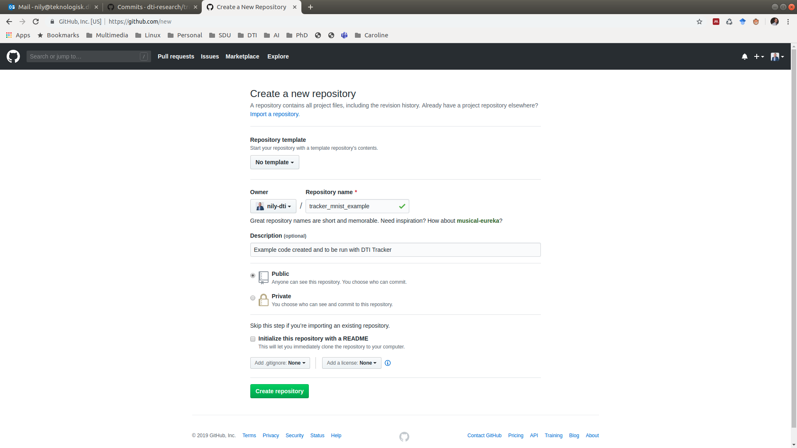
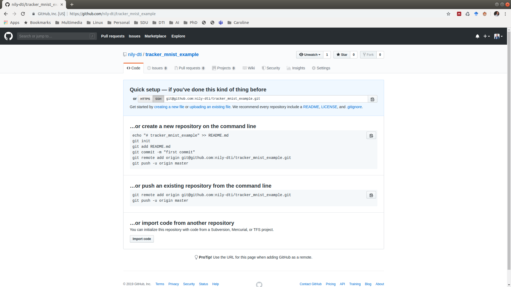
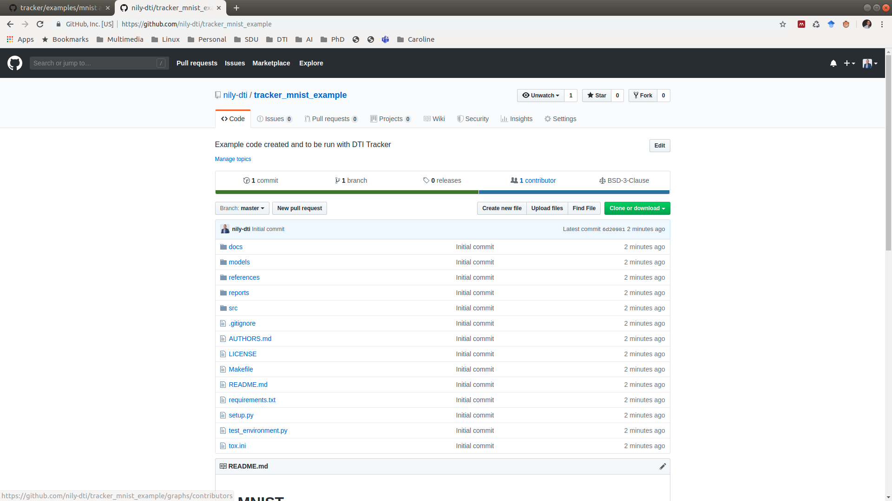

# Creating an Image Classifier with DTI Tracker

## Setting up the Project

1. Go to GitHub and set up an empty repo [Optional but recommended]





2. Create a YAML file similar to [gtsrb.yaml](./gtsrb.yaml)

3. Replace 'repo' key's value with the SSH adress of your empty repo

4. Invoke Tracker

```bash
tracker create gtsrb.yaml
```
5. Go back to GitHub and verify that Tracker has pushed the [ML Template](https://github.com/dti-research/ml-template) to your repository.



6. Begin coding!

## Setting up the Data Script

TBW

## Running and Tracking Experiments

TBW